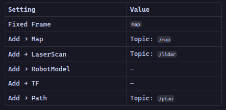

## Running SLAM with Waypoint Navigation

### Build the env

```sh
colcon build
```

### Launch the Simulation

```sh
ros2 launch simple_robot_description gazebo.launch.py
```

You can specify a world with:

```sh
ros2 launch simple_robot_description gazebo.launch.py world_name:=simple_world/small_house/small_warehouse(any of them)
```

<!-- ### Run SLAM Toolbox

```sh
ros2 launch slam_toolbox online_async_launch.py \
  use_sim_time:=True \
  slam_params_file:=$HOME/DevDrive/Projects/SensorFusion/simple_robot_description/config/slam_toolbox_params.yaml
```

### Nav2

```sh
ros2 launch nav2_bringup navigation_launch.py \
  use_sim_time:=True \
  params_file:=$HOME/DevDrive/Projects/SensorFusion/simple_robot_description/config/nav2_params.yaml
```

### Explore Lite (Autonomous Navigation)

```sh
ros2 launch explore_lite explore.launch.py
``` -->

### Run Control Nodes in another terminal (Manual Control)

```sh
ros2 run simple_robot_control robot_subscriber(W,S,A,D control).

# type-ros2 topic list (to find avaible topics from the simulation which you can use to access camera and other things.)
```

### Start Extended Kalman Filter Node

```sh
ros2 run simple_robot_control ekf_node --ros-args --params-file simple_robot_description/config/ekf_params.yaml
```

### Start Mapper Node

```sh
ros2 run simple_robot_control mapper_node
```

### RViz2

```sh
rviz2
```

Go to Add -> By Topic -> /map

<!-- ### Rviz2 Configuration

In RViz2, configure these displays:


### Waypoint Navigation in RViz2

Once the map is built enough:
Single goal: Click "2D Nav Goal" in the toolbar → click+drag on the map to set position and orientation
Waypoints: Click "Nav2 Goal" (if using the Nav2 RViz plugin) → set multiple waypoints → click "Start Navigation"

### Saving Map

```sh
mkdir map
ros2 run nav2_map_server map_saver_cli -f map/my_map_small_house
```

This saves my_map.pgm and my_map.yaml for later use with AMCL localization.

## Loading the saved map for localization

### Launch the Simulation

```sh
ros2 launch simple_robot_description gazebo.launch.py
```

### Load Map Server + AMCL

```sh
ros2 launch nav2_bringup localization_launch.py \
  use_sim_time:=True \
  map:=$HOME/DevDrive/Projects/SensorFusion/map/my_map_small_house.yaml
```

### Nav2

```sh
ros2 launch nav2_bringup navigation_launch.py \
  use_sim_time:=True \
  params_file:=$HOME/DevDrive/Projects/SensorFusion/simple_robot_description/config/nav2_params.yaml
``` -->
